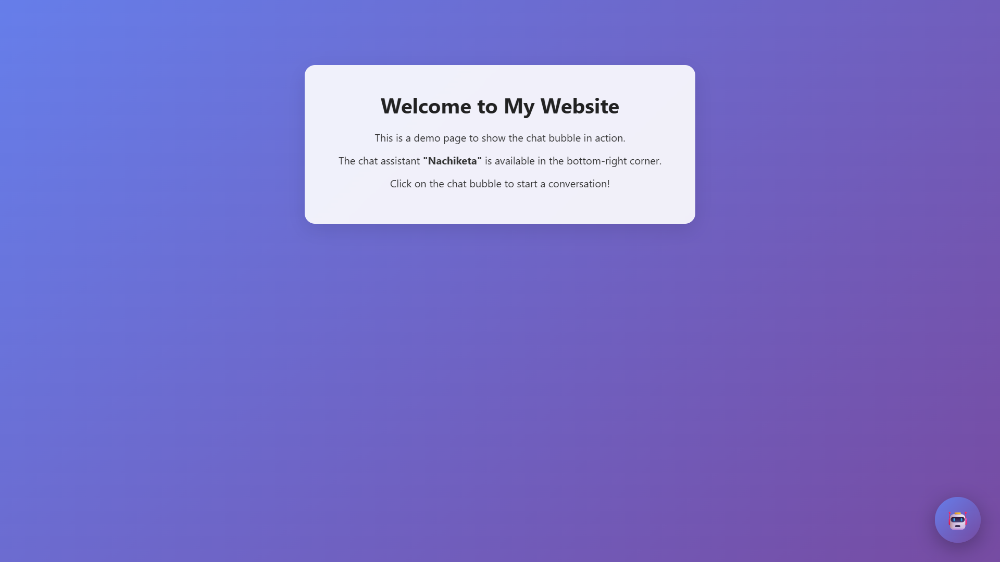

# 🤖 Nachiketa FAQ Chatbot

Welcome to **Nachiketa's FAQ Chatbot** — a simple, smart assistant that answers questions about me, my projects, and the freelance services I offer using a clean web interface.

---

### 🔍 What Is This?

This is a **retrieval-based chatbot** built using **Flask**, `faiss`, and `sentence-transformers`. It loads a curated FAQ dataset (`faq_data.json`), matches user queries using semantic search, and gives clear, pre-defined answers — all hosted on a beautiful frontend UI.

It's fast, runs fully server-side, and doesn't use any paid LLMs.  
The chatbot sits in the bottom-right corner, just like a support widget you'd find on any website.

---

### 💼 What Can You Ask It?

You can ask about:

- My education & background
- My major projects
- The AI/ML tools I've built
- My freelance services
- How to contact me
- My tech stack and skills
- Fun facts & creative stuff I've done

---

### 🛠 Tech Stack

| Feature         | Tech Used                         |
|-----------------|-----------------------------------|
| Frontend        | HTML + CSS + Vanilla JS           |
| Backend         | Flask (Python)                    |
| Semantic Search | FAISS + Sentence Transformers     |
| Data            | JSON-based FAQ                    |
| Deployment      | Render (free-tier)                |

---

### 🚀 Try It Out

To run locally:

```bash
git clone https://github.com/Nachiketa-Singamsetty/nachiketa-faq-bot.git
cd nachiketa-faq-bot
pip install -r requirements.txt
python app.py
```

Then open your browser at http://localhost:5000 🎉

To deploy it on Render:

```bash
# Add your repo
# Use gunicorn app:app as the start command
# Free tier works great!
```

---

### 🤝 Freelance Services I Offer

If you're a startup (especially non-tech), I can help you build:

- FAQ Chatbots
- Customer Segmentation Tools
- Smart Dashboards
- AI Code Assistants
- Social Media Tagging Systems
- OCR & Document Extractors
- Voice-to-Text Transcribers
- And more...

---

### 📬 Reach Me

nachiketa3003@gmail.com  
[LinkedIn](https://www.linkedin.com/) | [GitHub](https://github.com/)

---

### 📸 Demo Preview

[Live Demo](https://nachiketa-faq-bot.onrender.com)

> ⚡ **Note:** As this is hosted on Render's free tier, the website may take up to a minute to activate if it's been idle.



<!-- You can add a screenshot later -->

---

### 🌟 Why I Built This

I wanted a friendly, lightweight way for people (especially potential collaborators or clients) to explore my work, ask about my skills, or understand what I offer — without needing to read a full résumé.

This is also part of my journey as an AI/ML student who's passionate about building things that are simple, useful, and real.

---

### 🧠 Bonus: Want One Like This?

Ping me — I can build a custom FAQ/chat widget for your own site too ✨

---